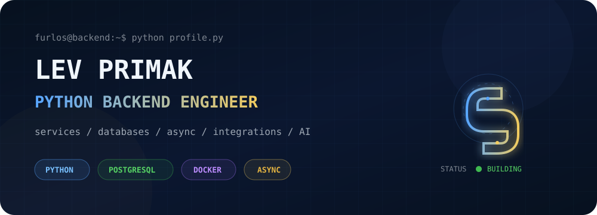
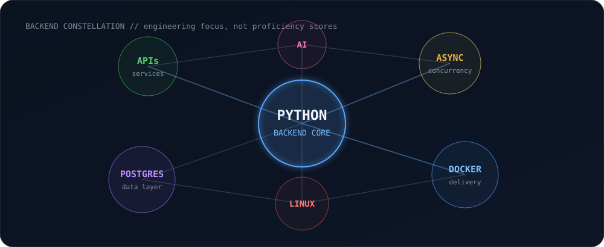
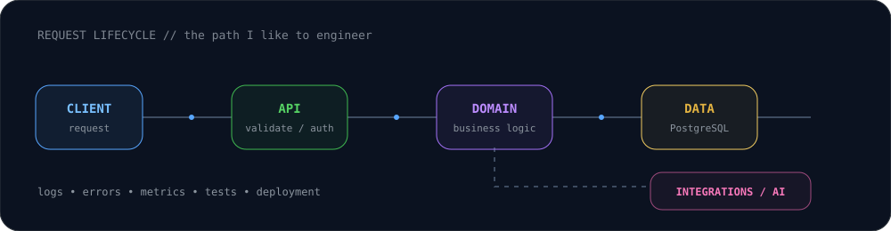
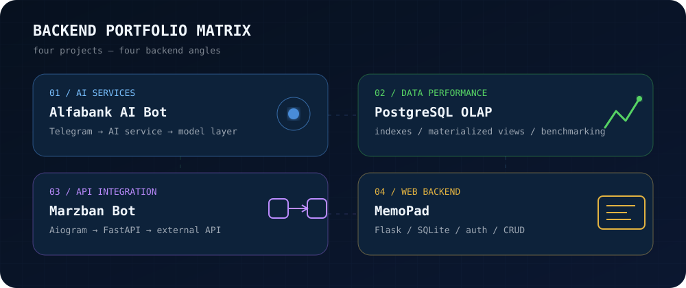

<p align="center">
  
</p>

<p align="center">
  <b>Python backend • APIs • PostgreSQL • async systems • AI integrations • automation</b>
</p>

<p align="center">
  <a href="https://github.com/Furlos?tab=repositories">Repositories</a> ·
  <a href="https://github.com/Furlos/alfabank-AI-bot">AI Services</a> ·
  <a href="https://github.com/Furlos/vtb_optimization">PostgreSQL Performance</a> ·
  <a href="https://github.com/Furlos/Marzban_bot">API Integration</a> ·
  <a href="https://github.com/Furlos/MemoPad">Web Backend</a>
</p>

---

## `> whoami`

I build backend systems in **Python** — from API and database layers to async workers, integrations, bots and AI-powered services.

I like projects where backend engineering is visible: clear boundaries, predictable data flow, useful abstractions, deployment and performance rather than just “it runs on my machine”.

```python
class Furlos:
    focus = ["Python", "Backend", "PostgreSQL", "AI integrations"]
    building = ["APIs", "services", "automation", "data-heavy systems"]
    principles = ["simple > clever", "measure > guess", "ship > overthink"]
```

<p align="center">
  
</p>

## ⚙️ Backend toolbox

<table>
<tr>
<td valign="top" width="33%">

**Core**

`Python` · `asyncio` · `OOP`  
`REST APIs` · `service design`  
`Telegram automation`

</td>
<td valign="top" width="33%">

**Data & infrastructure**

`PostgreSQL` · `SQL`  
`Docker` · `Docker Compose`  
`Linux` · `Git`

</td>
<td valign="top" width="33%">

**AI & integrations**

`LLM services` · `AI APIs`  
`bot ↔ service architecture`  
`external API integrations`

</td>
</tr>
</table>

<p align="center">
  
</p>

## 🚀 Selected engineering work

<p align="center">
  
</p>

<table>
<tr>
<td width="50%" valign="top">

### 🤖 [Alfabank AI Bot](https://github.com/Furlos/alfabank-AI-bot)

**Focus:** service architecture + AI integration

AI assistant for small business in Telegram, split into a **Telegram interface**, a dedicated **AI service** and a separate **model/LLM layer**. The project is packaged as multiple services with Docker Compose.

`Python` `AI/LLM` `Telegram` `Docker`

**Shows:** service separation, async integration, external model orchestration.

</td>
<td width="50%" valign="top">

### 🐘 [PostgreSQL OLAP Optimization](https://github.com/Furlos/vtb_optimization)

**Focus:** database performance + analytical workloads

Performance lab over millions of synthetic banking records. Explores **BRIN, partial and composite indexes**, materialized views and repeatable query timing for heavier OLAP-style analytics.

`Python` `PostgreSQL` `OLAP` `Performance`

**Shows:** query optimization thinking, data-heavy backend work, measurement-driven tuning.

</td>
</tr>
<tr>
<td width="50%" valign="top">

### ⚙️ [Marzban Bot](https://github.com/Furlos/Marzban_bot)

**Focus:** backend API + external system integration

Telegram automation built around a separate **FastAPI backend**. The bot acts as a client, while the backend owns validation and communication with the external Marzban API.

`Python` `FastAPI` `Aiogram` `HTTPX` `Docker`

**Shows:** transport/service separation, async HTTP, API boundaries, containerized services.

</td>
<td width="50%" valign="top">

### 📝 [MemoPad](https://github.com/Furlos/MemoPad)

**Focus:** classic web backend fundamentals

Local notes application with **authentication**, CRUD flows and persistent storage. A smaller project, but useful as a straightforward example of building a complete web flow from request to database.

`Python` `Flask` `SQLite` `HTML`

**Shows:** auth, CRUD, server-rendered web application, persistence basics.

</td>
</tr>
</table>

## 🧬 How I think about backend

```text
client request
    │
    ▼
validate ──► authorize ──► domain logic ──► persistence
    │                            │              │
    │                            └──► integrations
    │
    └──► useful errors + logs + metrics

            then measure the slow path and make it faster.
```

I’m especially interested in **Python backend development**, database-heavy systems, service architecture, optimization and practical AI integration.

---

<p align="center">
  <sub>Built as code, not as a screenshot. Every visual on this page is an SVG stored in this repository.</sub>
</p>
